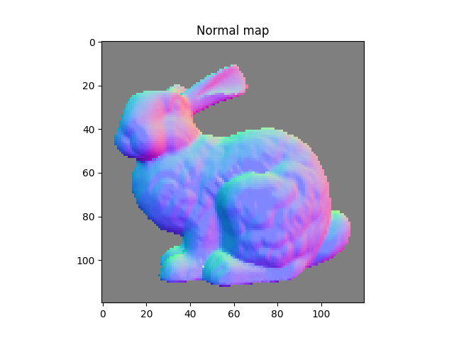
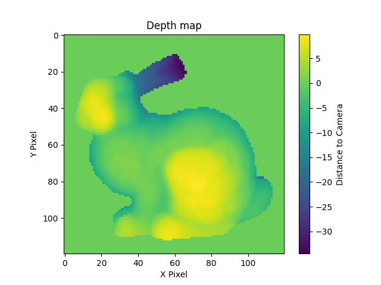
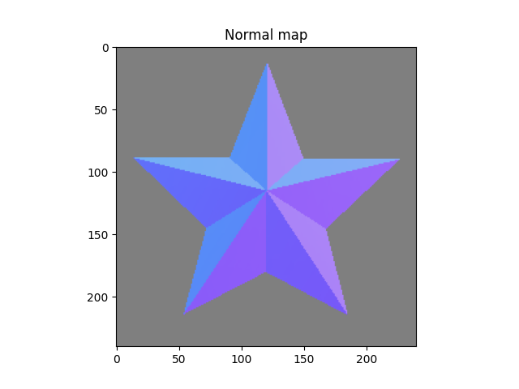
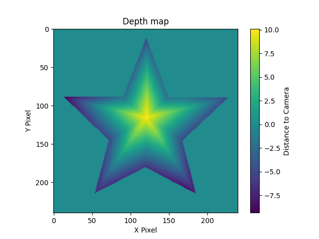
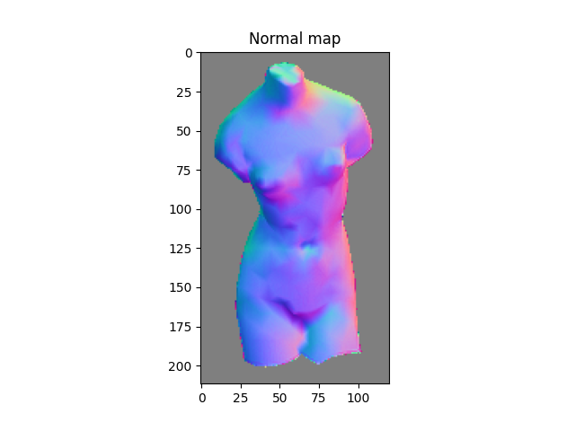
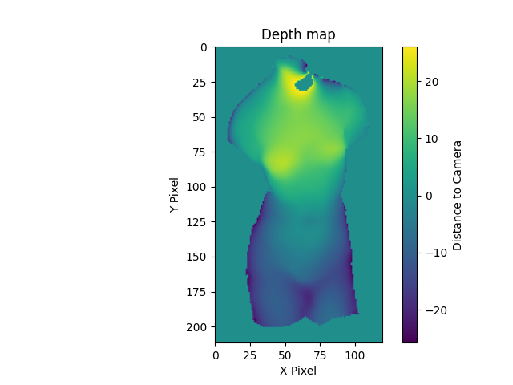
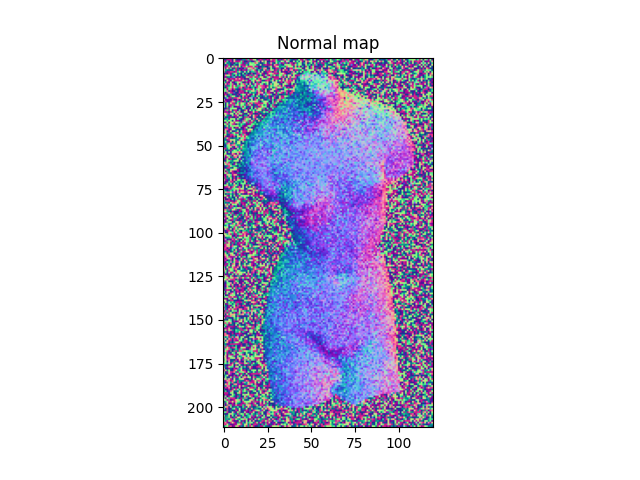
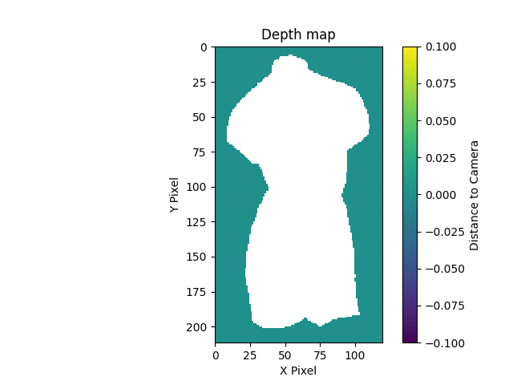
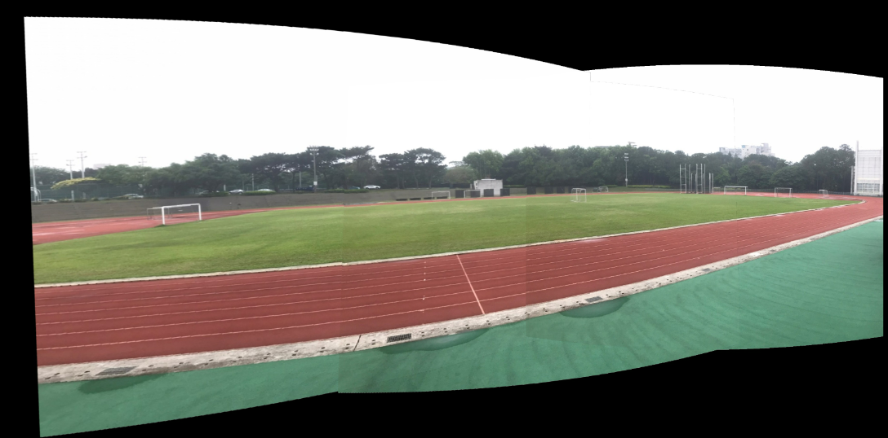
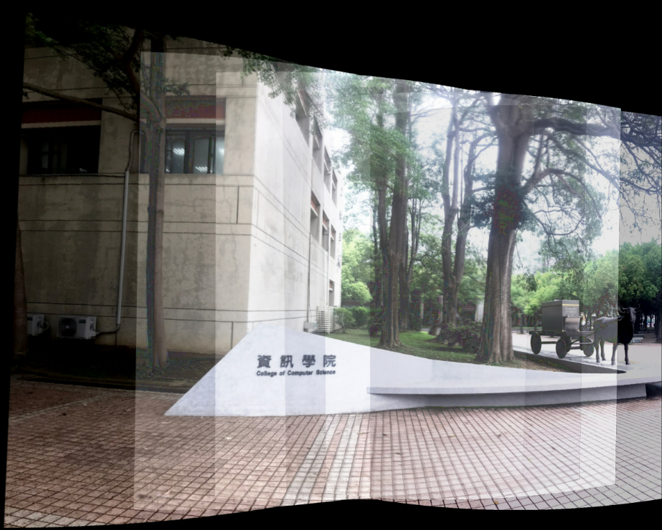

# Computer Vision Lab

Classical computer vision algorithms implemented from scratch in Python.
The core math (least squares, sparse linear systems, homography, RANSAC) is written with NumPy/SciPy; OpenCV is used only for image I/O, SIFT keypoints and final warping.

| Project | What it does |
|---|---|
| [Photometric Stereo](photometric_stereo/) | Recovers surface normals and a 3D mesh from images taken under different lighting |
| [Image Stitching](image_stitching/) | Builds a panorama from overlapping photos, with blending and exposure correction |

## Photometric Stereo

| | Normal map | Depth map |
|---|---|---|
| bunny |  |  |
| star |  |  |
| venus |  |  |
| noisy venus |  |  |

## Image Stitching

Panorama with cylindrical projection and intensity-weighted blending:

Six photos with different exposures, stitched after gain compensation:

See each project folder for method details.
