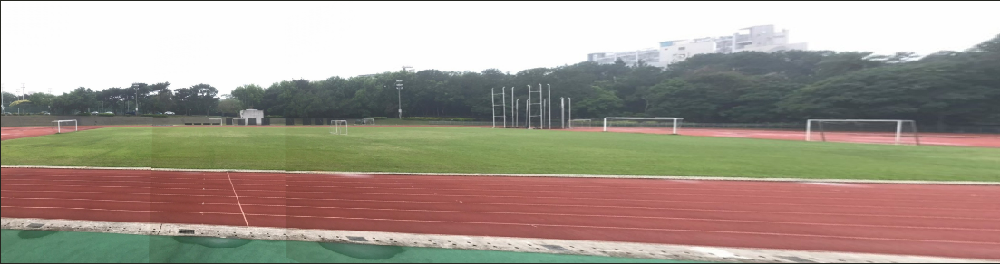
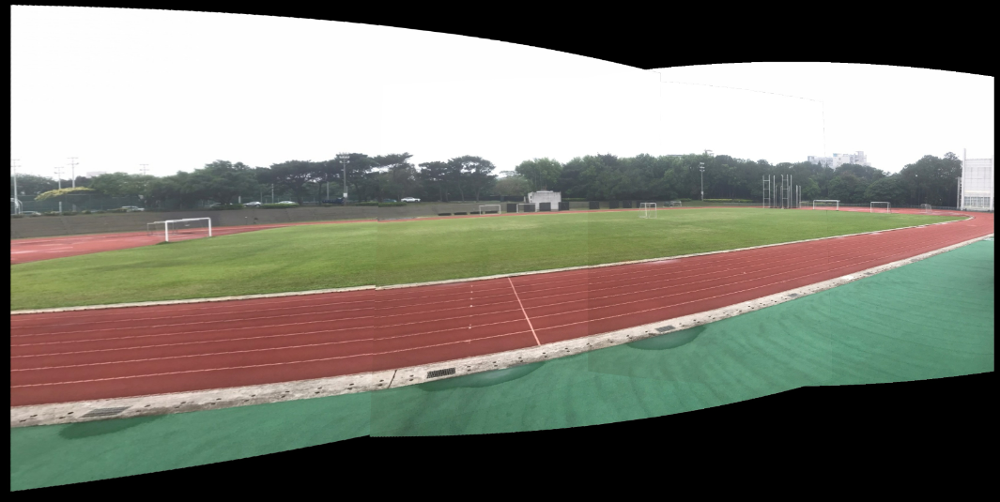
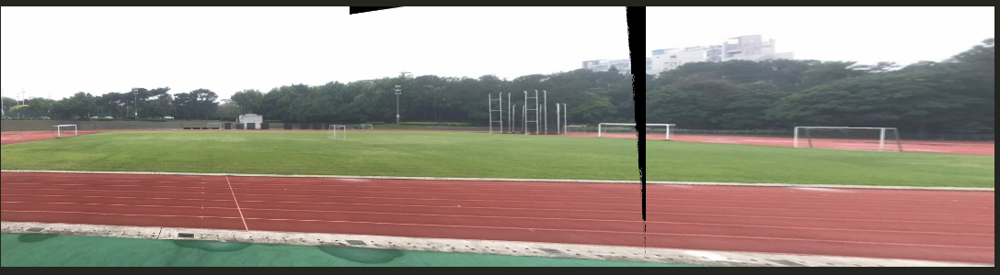

# Image Stitching

Stitch a sequence of overlapping photos into a panorama.
Only SIFT keypoint detection comes from OpenCV; matching, homography and RANSAC are implemented by hand.

## Method

1. **Cylindrical projection.** Each image is warped onto a cylinder by inverse mapping, so that a long panorama does not stretch at the ends. I swept the focal length from 200 to 2000; 1480–1580 gave the best results, and the code uses 1550.
2. **Features.** SIFT keypoints and 128-D descriptors (`cv2.SIFT_create`).
3. **Matching.** Brute-force 2-nearest-neighbor search on L2 descriptor distance, followed by Lowe's ratio test (ratio 0.75).
4. **Homography.** Direct linear transform from 4 point pairs, solved with SVD (the right singular vector of the smallest singular value), normalized so `h33 = 1`.
5. **RANSAC.** 8,000 iterations; each samples 4 matches, fits `H`, and counts inliers within 5 px. The `H` with the most inliers is kept.
6. **Warping.** The 4 transformed corners give the canvas size. A translation matrix shifts the origin so both images fit, then both are warped with `cv2.warpPerspective`. Images are stitched one by one onto the growing panorama.
7. **Blending.** I compared four options on the overlap region:
   - no blending: visible seams;
   - fixed weights: seams still obvious;
   - linear blending with a constant-width band around the overlap midline: smooth edges but some cracks;
   - **intensity-weighted blending (my design)**: each image is weighted by its mean intensity in the overlap. This gave the cleanest overlap.
8. **Gain compensation.** For a set of 6 photos taken with different exposures, I rescale each image before stitching by a gain based on the ratio between its mean intensity and the highest mean intensity in the set. A draft of the global least-squares gain solver from Brown & Lowe (2007) is also in the code (`compute_gain`), but the final result uses the simpler ratio method.

I also tried a second warping method: map every output pixel back through the inverse homography and sample the source image directly. It gave a cleaner panorama on the first set but more distortion on the exposure-varied set ([result](results/base_inverse_homography.png)).

## Results

| Blending | Result |
|---|---|
| None |  |
| Fixed weight |  |
| Linear, constant width |  |
| Intensity-weighted (final) |  |

Exposure-varied set with gain compensation:


## Run

```bash
pip install numpy opencv-python tqdm
# put your photos in ./Photos/Base/ and ./Photos/Exposure/ (not included)
python image_stitching.py -t Base             # stitch all photos in Photos/Base
python image_stitching.py -t Exposure -n 6    # stitch the first 6 photos in Photos/Exposure
```
